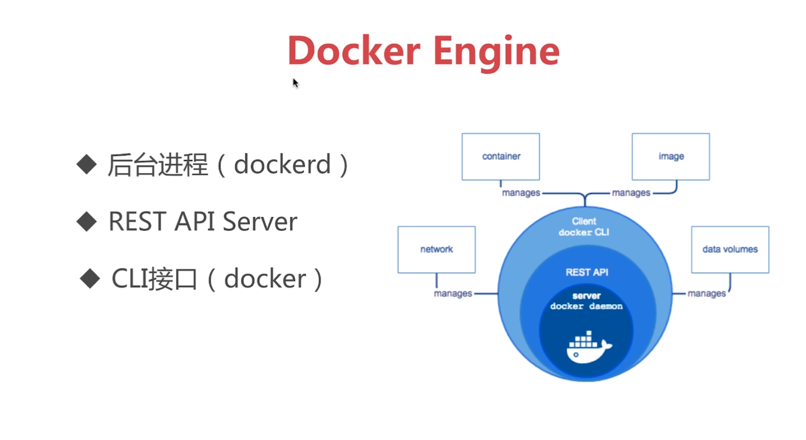
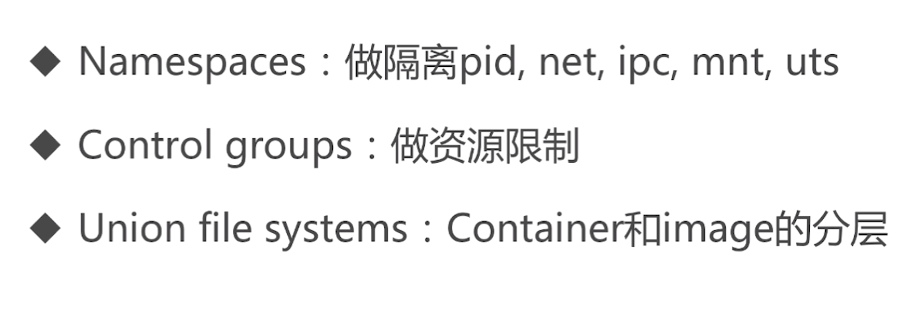
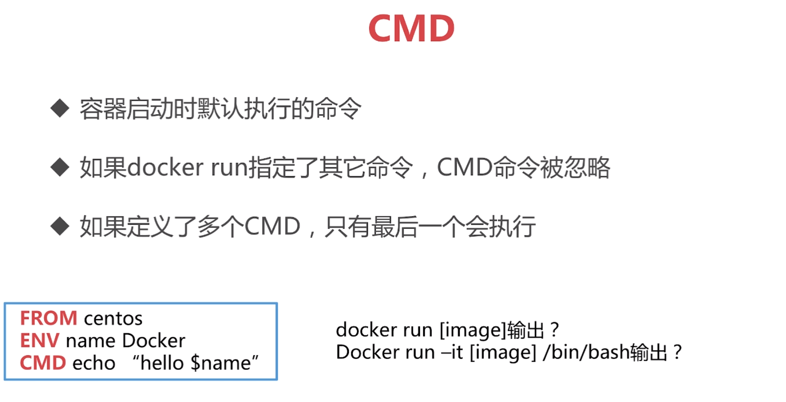
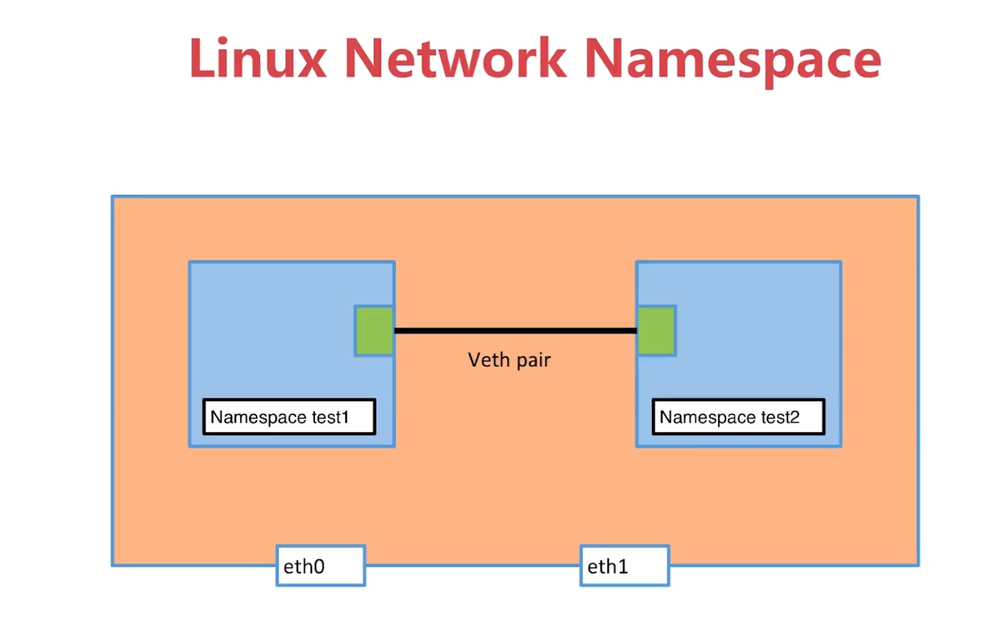
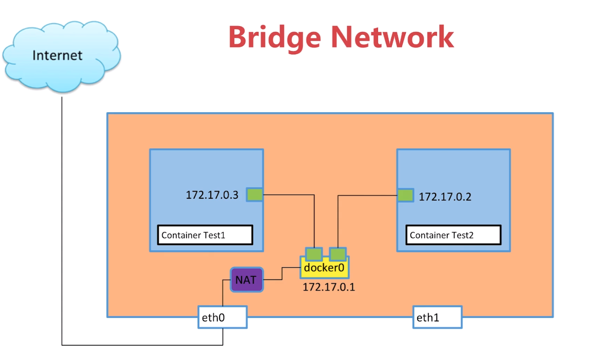
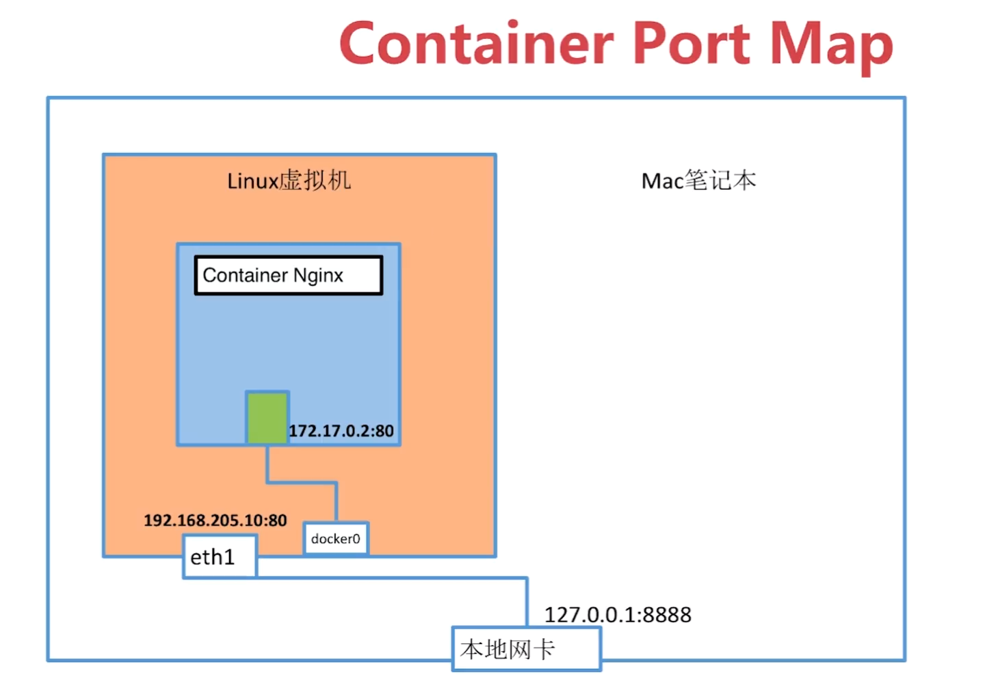

# Docker

------

## Docker Engine




## 底层技术




## 常用操作

### search

**从远程镜像仓库（Registry）查找docker镜像**

```shell
docker search centos	//查找centos镜像
```

### pull 

```shell
docker pull centos	//拉取centos镜像
```

### build

**自定义镜像，通过dockerfile构建镜像**

> docker image build [OPTIONS] PATH | URL | -
>

> docker build [OPTIONS] PATH | URL | -
>

Options:
      --build-arg list             Set build-time variables (default [])
      --cache-from stringSlice     Images to consider as cache sources
      --cgroup-parent string       Optional parent cgroup for the container
      --compress                   Compress the build context using gzip
      --cpu-period int             Limit the CPU CFS (Completely Fair Scheduler) period
      --cpu-quota int              Limit the CPU CFS (Completely Fair Scheduler) quota
  -c, --cpu-shares int             CPU shares (relative weight)
      --cpuset-cpus string         CPUs in which to allow execution (0-3, 0,1)
      --cpuset-mems string         MEMs in which to allow execution (0-3, 0,1)
      --disable-content-trust      Skip image verification (default true)
  -f, --file string                Name of the Dockerfile (Default is 'PATH/Dockerfile')
      --force-rm                   Always remove intermediate containers
      --help                       Print usage
      --isolation string           Container isolation technology
      --label list                 Set metadata for an image (default [])
  -m, --memory string              Memory limit
      --memory-swap string         Swap limit equal to memory plus swap: '-1' to enable unlimited swap
      --network string             Set the networking mode for the RUN instructions during build (default "default")
      --no-cache                   Do not use cache when building the image
      --pull                       Always attempt to pull a newer version of the image
  -q, --quiet                      Suppress the build output and print image ID on success
      --rm                         Remove intermediate containers after a successful build (default true)
      --security-opt stringSlice   Security options
      --shm-size string            Size of /dev/shm, default value is 64MB
  -t, --tag list                   Name and optionally a tag in the 'name:tag' format (default [])
      --ulimit ulimit              Ulimit options (default [])
  -v, --volume list                Set build-time bind mounts (default [])

#### **dockerfile**

> ```dockerfile
> FROM scratch
> WORKDIR /
> ADD test / 
> CMD test
> ```

**语法：**

- ARG key=value  //arg变量，构建image可以通过--build-arg <varname>=<value>
- FROM [scratch|[image:version]]
- LABEL key=value
- RUN command       //每RUN一次image会增加一层
- WORKDIR dir	//指定工作目录，若dir不存在，则会创建dir目录
- ADD	本地文件 目标目录	//添加本地定文件到image中指定的目录
- ADD 	test.tar.gz 目标目录	//自带解压功能
- COPY	本地文件 目标目录	//无解压功能
- curl&wget	//可用于添加远程文件
- ENV	变量名  变量值	//设置环境变量
- VOLUME    //创建外部卷
- EXPOSE	 //声明端口
- CMD     //设置默认命令
- ENTRYPOINT   //配置容器入口点

##### **命令格式**

- **Shell格式**

> ```dockerfile
> RUN yum install -y vim
> CMD echo "test CMD"
> ENTRYPOINT echo "test ENTRYPOINT"
> ENV hello=1234567890
> CMD echo "$hello"
> ```

- **Exec**

> ```dockerfile
> RUN [ "yum" , "install" , "-y" , "vim"]
> CMD [ "/bin/echo" , "test CMD" ]
> ENTRYPOINT [ "/bin/echo" , "test ENTRYPOINT" ]
> ENV hello=1234567890
> CMD [ "/bin/bash", "echo $hello" ]
> ```

##### CMD



### run（运行容器）

> Usage:	docker run [OPTIONS] IMAGE [COMMAND] [ARG...]
>
> Run a command in a new container
>
> Options:
>       --add-host list                         Add a custom host-to-IP mapping (host:ip) (default [])
>   -a, --attach list                           Attach to STDIN, STDOUT or STDERR (default [])
>       --blkio-weight uint16                   Block IO (relative weight), between 10 and 1000, or 0 to disable (default 0)
>       --blkio-weight-device weighted-device   Block IO weight (relative device weight) (default [])
>       --cap-add list                          Add Linux capabilities (default [])
>       --cap-drop list                         Drop Linux capabilities (default [])
>       --cgroup-parent string                  Optional parent cgroup for the container
>       --cidfile string                        Write the container ID to the file
>       --cpu-count int                         CPU count (Windows only)
>       --cpu-percent int                       CPU percent (Windows only)
>       --cpu-period int                        Limit CPU CFS (Completely Fair Scheduler) period
>       --cpu-quota int                         Limit CPU CFS (Completely Fair Scheduler) quota
>       --cpu-rt-period int                     Limit CPU real-time period in microseconds
>       --cpu-rt-runtime int                    Limit CPU real-time runtime in microseconds
>   -c, --cpu-shares int                        CPU shares (relative weight)
>       --cpus decimal                          Number of CPUs (default 0.000)
>       --cpuset-cpus string                    CPUs in which to allow execution (0-3, 0,1)
>       --cpuset-mems string                    MEMs in which to allow execution (0-3, 0,1)
>       --credentialspec string                 Credential spec for managed service account (Windows only)
>   -d, --detach                                Run container in background and print container ID
>
>  --detach-keys string                    Override the key sequence for detaching a container
>       --device list                           Add a host device to the container (default [])
>       --device-read-bps throttled-device      Limit read rate (bytes per second) from a device (default [])
>       --device-read-iops throttled-device     Limit read rate (IO per second) from a device (default [])
>       --device-write-bps throttled-device     Limit write rate (bytes per second) to a device (default [])
>       --device-write-iops throttled-device    Limit write rate (IO per second) to a device (default [])
>       --disable-content-trust                 Skip image verification (default true)
>       --dns list                              Set custom DNS servers (default [])
>       --dns-option list                       Set DNS options (default [])
>       --dns-search list                       Set custom DNS search domains (default [])
>       --entrypoint string                     Overwrite the default ENTRYPOINT of the image
>   -e, --env list                              Set environment variables (default [])
>       --env-file list                         Read in a file of environment variables (default [])
>       --expose list                           Expose a port or a range of ports (default [])
>       --group-add list                        Add additional groups to join (default [])
>       --health-cmd string                     Command to run to check health
>       --health-interval duration              Time between running the check (ns|us|ms|s|m|h) (default 0s)
>       --health-retries int                    Consecutive failures needed to report unhealthy
>       --health-timeout duration               Maximum time to allow one check to run (ns|us|ms|s|m|h) (default 0s)
>       --help                                  Print usage
>   -h, --hostname string                       Container host name
>       --init                                  Run an init inside the container that forwards signals and reaps processes
>       --init-path string                      Path to the docker-init binary
>   -i, --interactive                           Keep STDIN open even if not attached
>       --io-maxbandwidth string                Maximum IO bandwidth limit for the system drive (Windows only)
>       --io-maxiops uint                       Maximum IOps limit for the system drive (Windows only)
>       --ip string                             Container IPv4 address (e.g. 172.30.100.104)
>       --ip6 string                            Container IPv6 address (e.g. 2001:db8::33)
>       --ipc string                            IPC namespace to use
>       --isolation string                      Container isolation technology
>       --kernel-memory string                  Kernel memory limit
>   -l, --label list                            Set meta data on a container (default [])
>       --label-file list                       Read in a line delimited file of labels (default [])
>       --link list                             Add link to another container (default [])
>       --link-local-ip list                    Container IPv4/IPv6 link-local addresses (default [])
>       --log-driver string                     Logging driver for the container
>       --log-opt list                          Log driver options (default [])
>       --mac-address string                    Container MAC address (e.g. 92:d0:c6:0a:29:33)
>   -m, --memory string                         Memory limit
>       --memory-reservation string             Memory soft limit
>       --memory-swap string                    Swap limit equal to memory plus swap: '-1' to enable unlimited swap
>       --memory-swappiness int                 Tune container memory swappiness (0 to 100) (default -1)
>       --name string                           Assign a name to the container
>
> --network string                        Connect a container to a network (default "default")
>       --network-alias list                    Add network-scoped alias for the container (default [])
>       --no-healthcheck                        Disable any container-specified HEALTHCHECK
>       --oom-kill-disable                      Disable OOM Killer
>       --oom-score-adj int                     Tune host's OOM preferences (-1000 to 1000)
>       --pid string                            PID namespace to use
>       --pids-limit int                        Tune container pids limit (set -1 for unlimited)
>       --privileged                            Give extended privileges to this container
>   -p, --publish list                          Publish a container's port(s) to the host (default [])
>   -P, --publish-all                           Publish all exposed ports to random ports
>       --read-only                             Mount the container's root filesystem as read only
>       --restart string                        Restart policy to apply when a container exits (default "no")
>       --rm                                    Automatically remove the container when it exits
>       --runtime string                        Runtime to use for this container
>       --security-opt list                     Security Options (default [])
>       --shm-size string                       Size of /dev/shm, default value is 64MB
>       --sig-proxy                             Proxy received signals to the process (default true)
>       --stop-signal string                    Signal to stop a container, SIGTERM by default (default "SIGTERM")
>       --stop-timeout int                      Timeout (in seconds) to stop a container
>       --storage-opt list                      Storage driver options for the container (default [])
>       --sysctl map                            Sysctl options (default map[])
>       --tmpfs list                            Mount a tmpfs directory (default [])
>   -t, --tty                                   Allocate a pseudo-TTY
>       --ulimit ulimit                         Ulimit options (default [])
>   -u, --user string                           Username or UID (format: <name|uid>[:<group|gid>])
>       --userns string                         User namespace to use
>       --uts string                            UTS namespace to use
>   -v, --volume list                           Bind mount a volume (default [])
>       --volume-driver string                  Optional volume driver for the container
>       --volumes-from list                     Mount volumes from the specified container(s) (default [])
>   -w, --workdir string                        Working directory inside the container

```shell
[root@org-oz docker_net]# docker run -d -t mytest/centos-from-container /bin/bash
ecd84150392304307df6f0d57ef9955065e873a4da1f2725ac41c68cafb7c567
```


### exec（访问容器）

> Usage:	docker exec [OPTIONS] CONTAINER COMMAND [ARG...]
>
> Run a command in a running container
>
> Options:
>   -d, --detach               Detached mode: run command in the background
>       --detach-keys string   Override the key sequence for detaching a container
>   -e, --env list             Set environment variables (default [])
>       --help                 Print usage
>   -i, --interactive          Keep STDIN open even if not attached
>       --privileged           Give extended privileges to the command
>   -t, --tty                  Allocate a pseudo-TTY
>   -u, --user string          Username or UID (format: <name|uid>[:<group|gid>])

```shell
[root@org-oz docker_net]# docker exec ecd841503923 /bin/bash -c 'ip addr'
1: lo: <LOOPBACK,UP,LOWER_UP> mtu 65536 qdisc noqueue state UNKNOWN group default qlen 1000
    link/loopback 00:00:00:00:00:00 brd 00:00:00:00:00:00
    inet 127.0.0.1/8 scope host lo
       valid_lft forever preferred_lft forever
    inet6 ::1/128 scope host 
       valid_lft forever preferred_lft forever
43: eth0@if44: <BROADCAST,MULTICAST,UP,LOWER_UP> mtu 1500 qdisc noqueue state UP group default 
    link/ether 02:42:ac:11:00:03 brd ff:ff:ff:ff:ff:ff link-netnsid 0
    inet 172.17.0.3/16 scope global eth0
       valid_lft forever preferred_lft forever
    inet6 fe80::42:acff:fe11:3/64 scope link 
       valid_lft forever preferred_lft forever
```


### image（镜像）

> Usage:	docker image ls [OPTIONS] [REPOSITORY[:TAG]]
>
> List images
>
> Aliases:
>   ls, images, list
>
> Options:
>   -a, --all             Show all images (default hides intermediate images)
>       --digests         Show digests
>   -f, --filter filter   Filter output based on conditions provided
>       --format string   Pretty-print images using a Go template
>       --help            Print usage
>       --no-trunc        Don't truncate output
>   -q, --quiet           Only show numeric IDs
> [root@org-oz docker_net]# docker image --help
>
> Usage:	docker image COMMAND
>
> Manage images
>
> Options:
>       --help   Print usage
>
> Commands:
>   build       Build an image from a Dockerfile
>   history     Show the history of an image
>   import      Import the contents from a tarball to create a filesystem image
>   inspect     Display detailed information on one or more images
>   load        Load an image from a tar archive or STDIN
>   ls          List images
>   prune       Remove unused images
>   pull        Pull an image or a repository from a registry
>   push        Push an image or a repository to a registry
>   rm          Remove one or more images
>   save        Save one or more images to a tar archive (streamed to STDOUT by default)
>   tag         Create a tag TARGET_IMAGE that refers to SOURCE_IMAGE

#### ls（查看image）

> Usage:	docker image ls [OPTIONS] [REPOSITORY[:TAG]]
>
> List images
>
> Aliases:
>   ls, images, list
>
> Options:
>   -a, --all             Show all images (default hides intermediate images)
>       --digests         Show digests
>   -f, --filter filter   Filter output based on conditions provided
>       --format string   Pretty-print images using a Go template
>       --help            Print usage
>       --no-trunc        Don't truncate output
>   -q, --quiet           Only show numeric IDs

```shell
docker image ls
docker images
```

#### rm（删除image）

> Usage:	docker image rm [OPTIONS] IMAGE [IMAGE...]
>
> Remove one or more images
>
> Aliases:
>   rm, rmi, remove
>
> Options:
>   -f, --force      Force removal of the image
>       --help       Print usage
>       --no-prune   Do not delete untagged parents

```shell
docker image `image名`
```


### container（容器）

> Usage:	docker container COMMAND
>
> Manage containers
>
> Options:
>       --help   Print usage
>
> Commands:
>   attach      Attach to a running container
>   commit      Create a new image from a container's changes
>   cp          Copy files/folders between a container and the local filesystem
>   create      Create a new container
>   diff        Inspect changes on a container's filesystem
>   exec        Run a command in a running container
>   export      Export a container's filesystem as a tar archive
>   inspect     Display detailed information on one or more containers
>   kill        Kill one or more running containers
>   logs        Fetch the logs of a container
>   ls          List containers
>   pause       Pause all processes within one or more containers
>   port        List port mappings or a specific mapping for the container
>   prune       Remove all stopped containers
>   rename      Rename a container
>   restart     Restart one or more containers
>   rm          Remove one or more containers
>   run         Run a command in a new container
>   start       Start one or more stopped containers
>   stats       Display a live stream of container(s) resource usage statistics
>   stop        Stop one or more running containers
>   top         Display the running processes of a container
>   unpause     Unpause all processes within one or more containers
>   update      Update configuration of one or more containers
>   wait        Block until one or more containers stop, then print their exit codes

#### ps（查看容器）

#### commit

> 基于container创建docker iamge
>

> Usage:	docker container commit [OPTIONS] CONTAINER [REPOSITORY[:TAG]]
>
> Create a new image from a container's changes
>
> Options:
>   -a, --author string    Author (e.g., "John Hannibal Smith <hannibal@a-team.com>")
>   -c, --change list      Apply Dockerfile instruction to the created image (default [])
>       --help             Print usage
>   -m, --message string   Commit message
>   -p, --pause            Pause container during commit (default true)

```shell
docker container commit 91f974090358 mytest/centos-from-container
```


## namespace（网络命名空间）

> **用于资源隔离**

### ip

#### ip addr（显示/操纵路由，网络设备，接口和隧道）

> **ip [ OPTIONS ] OBJECT { COMMAND | help }**
>
>    ip [ -force ] -batch filename
>
>    OBJECT := { link | address | addrlabel | route | rule | neigh | ntable | tunnel | tuntap | maddress |
>            mroute | mrule | monitor | xfrm | netns | l2tp | tcp_metrics | token | macsec }
>
>    OPTIONS := { -V[ersion] | -h[uman-readable] | -s[tatistics] | -d[etails] | -r[esolve] | -iec |
>            -f[amily] { inet | inet6 | link } | -4 | -6 | -I | -D | -B | -0 | -l[oops] { maximum-addr-
>            flush-attempts } | -o[neline] | -rc[vbuf] [size] | -t[imestamp] | -ts[hort] | -n[etns] name |
>            -a[ll] | -c[olor] | -br[ief] | -j[son] | -p[retty] }

##### 查看网络接口和IP（ip addr | ip a）

```shell
[root@org-oz docker_net]# ip addr
1: lo: <LOOPBACK,UP,LOWER_UP> mtu 65536 qdisc noqueue state UNKNOWN group default qlen 1000
    link/loopback 00:00:00:00:00:00 brd 00:00:00:00:00:00
    inet 127.0.0.1/8 scope host lo
       valid_lft forever preferred_lft forever
    inet6 ::1/128 scope host 
       valid_lft forever preferred_lft forever
2: enp9s0: <NO-CARRIER,BROADCAST,MULTICAST,UP> mtu 1500 qdisc fq_codel state DOWN group default qlen 1000
。。。
```

##### add（为网络接口添加ip地址）

```shell
ip netns exec test2 ip addr add 192.168.1.1/24 dev veth-test2	//为veth-test2添加ip地址:192.168.1.1
ip netns exec test3 ip addr add 192.168.1.2/24 dev veth-test3	//为veth-test3添加ip地址:192.168.1.2
[root@org-oz docker_net]# ip netns exec test2 ip addr
1: lo: <LOOPBACK,UP,LOWER_UP> mtu 65536 qdisc noqueue state UNKNOWN group default qlen 1000
    link/loopback 00:00:00:00:00:00 brd 00:00:00:00:00:00
    inet 127.0.0.1/8 scope host lo
       valid_lft forever preferred_lft forever
    inet6 ::1/128 scope host 
       valid_lft forever preferred_lft forever
32: veth-test2@if31: <BROADCAST,MULTICAST> mtu 1500 qdisc noop state DOWN group default qlen 1000
    link/ether 86:7f:e5:c4:36:53 brd ff:ff:ff:ff:ff:ff link-netns test3
    inet 192.168.1.1/24 scope global veth-test2
       valid_lft forever preferred_lft forever

[root@org-oz docker_net]# ip netns exec test3 ip addr
1: lo: <LOOPBACK,UP,LOWER_UP> mtu 65536 qdisc noqueue state UNKNOWN group default qlen 1000
    link/loopback 00:00:00:00:00:00 brd 00:00:00:00:00:00
    inet 127.0.0.1/8 scope host lo
       valid_lft forever preferred_lft forever
    inet6 ::1/128 scope host 
       valid_lft forever preferred_lft forever
31: veth-test3@if32: <BROADCAST,MULTICAST> mtu 1500 qdisc noop state DOWN group default qlen 1000
    link/ether ea:84:7e:9f:0b:64 brd ff:ff:ff:ff:ff:ff link-netns test2
    inet 192.168.1.2/24 scope global veth-test3
       valid_lft forever preferred_lft forever
       
ip netns exec test2 ip link set dev veth-test2 up	//启动veth-test2
[root@org-oz docker_net]# ip netns exec test2 ip link
1: lo: <LOOPBACK,UP,LOWER_UP> mtu 65536 qdisc noqueue state UNKNOWN mode DEFAULT group default qlen 1000
    link/loopback 00:00:00:00:00:00 brd 00:00:00:00:00:00
32: veth-test2@if31: <BROADCAST,MULTICAST,UP,LOWER_UP> mtu 1500 qdisc noqueue state UP mode DEFAULT group default qlen 1000
    link/ether 86:7f:e5:c4:36:53 brd ff:ff:ff:ff:ff:ff link-netns test3
    
ip netns exec test3 ip link set dev veth-test3 up	//启动veth-test3
[root@org-oz docker_net]# ip netns exec test3 ip link
1: lo: <LOOPBACK,UP,LOWER_UP> mtu 65536 qdisc noqueue state UNKNOWN mode DEFAULT group default qlen 1000
    link/loopback 00:00:00:00:00:00 brd 00:00:00:00:00:00
31: veth-test3@if32: <BROADCAST,MULTICAST,UP,LOWER_UP> mtu 1500 qdisc noqueue state UP mode DEFAULT group default qlen 1000
    link/ether ea:84:7e:9f:0b:64 brd ff:ff:ff:ff:ff:ff link-netns test2

//测试    
[root@org-oz docker_net]# ip netns exec test2 ping 192.168.1.1
PING 192.168.1.1 (192.168.1.1) 56(84) bytes of data.
64 bytes from 192.168.1.1: icmp_seq=1 ttl=64 time=0.040 ms
64 bytes from 192.168.1.1: icmp_seq=2 ttl=64 time=0.058 ms
64 bytes from 192.168.1.1: icmp_seq=3 ttl=64 time=0.062 ms
64 bytes from 192.168.1.1: icmp_seq=4 ttl=64 time=0.065 ms
64 bytes from 192.168.1.1: icmp_seq=5 ttl=64 time=0.060 ms
64 bytes from 192.168.1.1: icmp_seq=6 ttl=64 time=0.061 ms
64 bytes from 192.168.1.1: icmp_seq=7 ttl=64 time=0.058 ms
64 bytes from 192.168.1.1: icmp_seq=8 ttl=64 time=0.058 ms    
[root@org-oz docker_net]# ip netns exec test3 ping 192.168.1.2
PING 192.168.1.2 (192.168.1.2) 56(84) bytes of data.
64 bytes from 192.168.1.2: icmp_seq=1 ttl=64 time=0.040 ms
64 bytes from 192.168.1.2: icmp_seq=2 ttl=64 time=0.063 ms
64 bytes from 192.168.1.2: icmp_seq=3 ttl=64 time=0.058 ms
64 bytes from 192.168.1.2: icmp_seq=4 ttl=64 time=0.058 ms
64 bytes from 192.168.1.2: icmp_seq=5 ttl=64 time=0.064 ms
```


#### ip netns（网络命名空间管理）

##### list（查看网络命名空间）

```shell
root@org-oz docker_net]# ip netns list
```

##### add（创建网络命名空间）

```shell
[root@org-oz docker_net]# ip netns add test
[root@org-oz docker_net]# ip netns list
test
```

##### delete（删除网络命名空间）

```shell
[root@org-oz docker_net]# ip netns delete test
[root@org-oz docker_net]# ip netns list
```

##### exec（在网络命名空间中执行命令）

格式：

> ip netns exec 命名空间 命令

```shell
[root@org-oz docker_net]# ip netns exec test ip addr
1: lo: <LOOPBACK> mtu 65536 qdisc noop state DOWN group default qlen 1000
    link/loopback 00:00:00:00:00:00 brd 00:00:00:00:00:00

```


#### ip link（网络设备配置）

##### set（网络设备设置）

格式：

> ip link set { DEVICE | group GROUP }
>                [ { up | down } ]
>                [ type ETYPE TYPE_ARGS ]
>                [ arp { on | off } ]
>                [ dynamic { on | off } ]
>                [ multicast { on | off } ]
>                [ allmulticast { on | off } ]
>                [ promisc { on | off } ]
>                [ protodown { on | off } ]
>                [ trailers { on | off } ]
>                [ txqueuelen PACKETS ]
>                [ name NEWNAME ]
>                [ address LLADDR ]
>                [ broadcast LLADDR ]
>                [ mtu MTU ]
>                [ netns { PID | NETNSNAME } ]
>                [ link-netnsid ID ]
>                [ alias NAME ]
>                [ vf NUM [ mac LLADDR ]
>                         [ VFVLAN-LIST ]
>                         [ rate TXRATE ]
>                         [ max_tx_rate TXRATE ]
>                         [ min_tx_rate TXRATE ]
>                         [ spoofchk { on | off } ]
>                         [ query_rss { on | off } ]
>                         [ state { auto | enable | disable } ]
>                         [ trust { on | off } ]
>                         [ node_guid eui64 ]
>                         [ port_guid eui64 ] ]
>                [ { xdp | xdpgeneric | xdpdrv | xdpoffload } { off |
>                        object FILE [ section NAME ] [ verbose ] |
>                        pinned FILE } ]
>                [ master DEVICE ]
>                [ nomaster ]
>                [ vrf NAME ]
>                [ addrgenmode { eui64 | none | stable_secret | random } ]
>                [ macaddr { flush | { add | del } MACADDR | set [ MACADDR [ MACADDR [ ... ] ] ] } ]

###### 查看网络接口（ip link）

```shell
ip link	//查看网络接口
```


###### 启动网络设备

```shell
[root@org-oz docker_net]# ip netns exec test ip link
1: lo: <LOOPBACK> mtu 65536 qdisc noop state DOWN mode DEFAULT group default qlen 1000
    link/loopback 00:00:00:00:00:00 brd 00:00:00:00:00:00
[root@org-oz docker_net]# ip netns exec test ip link set dev lo up
[root@org-oz docker_net]# ip netns exec test ip link
1: lo: <LOOPBACK,UP,LOWER_UP> mtu 65536 qdisc noqueue state UNKNOWN mode DEFAULT group default qlen 1000
    link/loopback 00:00:00:00:00:00 brd 00:00:00:00:00:00
```

###### 把link（网络接口）添加至指定namespace（网络命名空间）

```shell
ip netns add test2	//创建namespace test2
ip netns add test3	//创建namespace test3
ip netns exec test2 ip link set dev lo up	//启动namespace test2中lo网络接口
ip netns exec test3 ip link set dev lo up	//启动namespace test3中lo网络接口
ip link add veth-test2 type veth peer name veth-test3	//创建一对peer veth(虚拟以太网接口)veth-test2和veth-test3
ip link set veth-test2 netns test2	//将veth-test2添加至test2
ip link set veth-test3 netns test3	//将veth-test3添加至test3
ip netns exec test2 ip link	//查看test2网络接口
结果：[root@org-oz docker_net]# docker exec ecd841503923 /bin/bash -c 'ip addr'
1: lo: <LOOPBACK,UP,LOWER_UP> mtu 65536 qdisc noqueue state UNKNOWN group default qlen 1000
    link/loopback 00:00:00:00:00:00 brd 00:00:00:00:00:00
    inet 127.0.0.1/8 scope host lo
       valid_lft forever preferred_lft forever
    inet6 ::1/128 scope host 
       valid_lft forever preferred_lft forever
43: eth0@if44: <BROADCAST,MULTICAST,UP,LOWER_UP> mtu 1500 qdisc noqueue state UP group default 
    link/ether 02:42:ac:11:00:03 brd ff:ff:ff:ff:ff:ff link-netnsid 0
    inet 172.17.0.3/16 scope global eth0
       valid_lft forever preferred_lft forever
    inet6 fe80::42:acff:fe11:3/64 scope link 
       valid_lft forever preferred_lft forever
	1: lo: <LOOPBACK,UP,LOWER_UP> mtu 65536 qdisc noqueue state UNKNOWN mode DEFAULT group 		default qlen 1000
    link/loopback 00:00:00:00:00:00 brd 00:00:00:00:00:00
	32: veth-test2@if31: <BROADCAST,MULTICAST> mtu 1500 qdisc noop state DOWN mode DEFAULT 		group default qlen 1000
    link/ether 86:7f:e5:c4:36:53 brd ff:ff:ff:ff:ff:ff link-netns test3

ip netns exec test3 ip link	//查看test3网络接口
结果：
	1: lo: <LOOPBACK,UP,LOWER_UP> mtu 65536 qdisc noqueue state UNKNOWN mode DEFAULT group 		default qlen 1000
    link/loopback 00:00:00:00:00:00 brd 00:00:00:00:00:00
	31: veth-test3@if32: <BROADCAST,MULTICAST> mtu 1500 qdisc noop state DOWN mode DEFAULT 		group default qlen 1000
    link/ether ea:84:7e:9f:0b:64 brd ff:ff:ff:ff:ff:ff link-netns test2
```


##### add（添加虚拟link）

> ip link add [ link DEVICE ] [ name ] NAME
>                [ txqueuelen PACKETS ]
>                [ address LLADDR ] [ broadcast LLADDR ]
>                [ mtu MTU ] [ index IDX ]
>                [ numtxqueues QUEUE_COUNT ] [ numrxqueues QUEUE_COUNT ]
>                [ gso_max_size BYTES ] [ gso_max_segs SEGMENTS ]
>                type TYPE [ ARGS ]



###### 创建一对peer虚拟网络接口

```shell
[root@org-oz docker_net]# ip link add veth-test2 type veth peer name veth-test3
[root@org-oz docker_net]# ip link
1: lo: <LOOPBACK,UP,LOWER_UP> mtu 65536 qdisc noqueue state UNKNOWN mode DEFAULT group default qlen 1000
    link/loopback 00:00:00:00:00:00 brd 00:00:00:00:00:00
。。。
31: veth-test3@veth-test2: <BROADCAST,MULTICAST,M-DOWN> mtu 1500 qdisc noop state DOWN mode DEFAULT group default qlen 1000
    link/ether ea:84:7e:9f:0b:64 brd ff:ff:ff:ff:ff:ff
32: veth-test2@veth-test3: <BROADCAST,MULTICAST,M-DOWN> mtu 1500 qdisc noop state DOWN mode DEFAULT group default qlen 1000
    link/ether 86:7f:e5:c4:36:53 brd ff:ff:ff:ff:ff:ff
```


## Docker网络

### docker network

> Usage:	docker network COMMAND
>
> Manage networks
>
> Options:
>       --help   Print usage
>
> Commands:
>   connect     Connect a container to a network
>   create      Create a network
>   disconnect  Disconnect a container from a network
>   inspect     Display detailed information on one or more networks
>   ls          List networks
>   prune       Remove all unused networks
>   rm          Remove one or more networks

#### ls（查看网络）

> Usage:	docker network ls [OPTIONS]
>
> List networks
>
> Aliases:
>   ls, list
>
> Options:
>   -f, --filter filter   Provide filter values (e.g. 'driver=bridge')
>       --format string   Pretty-print networks using a Go template
>       --help            Print usage
>       --no-trunc        Do not truncate the output
>   -q, --quiet           Only display network IDs

```shell
[root@org-oz docker_net]# docker network ls
NETWORK ID          NAME                DRIVER              SCOPE
a24ce0ad29e4        bridge              bridge              local
d12a240afd85        host                host                local
69853a2a213a        none                null                local
```

#### inspect（查看网络配置）

> Usage:	docker network inspect [OPTIONS] NETWORK [NETWORK...]
>
> Display detailed information on one or more networks
>
> Options:
>   -f, --format string   Format the output using the given Go template
>       --help            Print usage

```shell
[root@org-oz docker_net]# docker network inspect a24ce0ad29e4
[
    {
        "Name": "bridge",
        "Id": "a24ce0ad29e4926a8199b4d01cabe8cdf6a7c5bbf015c57270fae6e7b77b67d1",
        "Created": "2019-10-31T14:32:42.553197976+08:00",
        "Scope": "local",
        "Driver": "bridge",
        "EnableIPv6": false,
        "IPAM": {
            "Driver": "default",
            "Options": null,
            "Config": [
                {
                    "Subnet": "172.17.0.0/16",
                    "Gateway": "172.17.0.1"
                }
            ]
        },
        "Internal": false,
        "Attachable": false,
        "Containers": {
            "91f9740903588a4d7c602ecaa6ac435c4360630394b6877c999aab42bde2942c": {
                "Name": "confident_edison",
                "EndpointID": "819c720fe8134073f04dd34ae720a4c599e15e5c0f06eebde3ab37becdc4a4d6",
                "MacAddress": "02:42:ac:11:00:02",
                "IPv4Address": "172.17.0.2/16",
                "IPv6Address": ""
            },
            "ecd84150392304307df6f0d57ef9955065e873a4da1f2725ac41c68cafb7c567": {
                "Name": "nervous_lewin",
                "EndpointID": "03e1a9217fcb0818560741ca9edc51cc38e40f8fb2e976596ea4477dfb72f5c8",
                "MacAddress": "02:42:ac:11:00:03",
                "IPv4Address": "172.17.0.3/16",
                "IPv6Address": ""
            }
        },
        "Options": {
            "com.docker.network.bridge.default_bridge": "true",
            "com.docker.network.bridge.enable_icc": "true",
            "com.docker.network.bridge.enable_ip_masquerade": "true",
            "com.docker.network.bridge.host_binding_ipv4": "0.0.0.0",
            "com.docker.network.bridge.name": "docker0",
            "com.docker.network.driver.mtu": "1500"
        },
        "Labels": {}
    }
]

```

#### create（创建一个docker网络）

> Usage:	docker network create [OPTIONS] NETWORK
>
> Create a network
>
> Options:
>       --attachable             Enable manual container attachment
>       --aux-address map        Auxiliary IPv4 or IPv6 addresses used by Network driver (default map[])
>   -d, --driver string          Driver to manage the Network (default "bridge")
>       --gateway stringSlice    IPv4 or IPv6 Gateway for the master subnet
>       --help                   Print usage
>       --internal               Restrict external access to the network
>       --ip-range stringSlice   Allocate container ip from a sub-range
>       --ipam-driver string     IP Address Management Driver (default "default")
>       --ipam-opt map           Set IPAM driver specific options (default map[])
>       --ipv6                   Enable IPv6 networking
>       --label list             Set metadata on a network (default [])
>   -o, --opt map                Set driver specific options (default map[])
>       --subnet stringSlice     Subnet in CIDR format that represents a network segment

```shell
docker network create -d bridge test-bridge	//创建一个bridge网络test-bridge
docker run -d -t --network test-bridge --name test-bridge2 busybox	//创建容器test-bridge2并指定test-bridge网络
docker run -d -t --network test-bridge --name test-bridge3 busybox	//创建容器test-bridge3并指定test-bridge网络
[root@org-oz docker_net]# brctl show
bridge name	bridge id		STP 			enabled		interfaces
br-3b3050dd0a90		8000.02429482f502			no		veth71b51de
														veth816377f
docker0				8000.0242da8ecfa8			no		veth2cd7f8d
														veth36df8d3
														veth40d2b49
														veth412fb90
														vethc464fbe
virbr0		   		8000.525400e3753a	       yes		virbr0-nic

```

> 将容器指定为自己创建的网络，默认容器之间可以通过容器名称进行网络通信，与docker默认网络不同，默认网络容器之间若要通过容器名称通信，则需要通过--link指定容器名称

```shell
[root@org-oz docker_net]# docker exec test-bridge2 ping test-bridge3
PING test-bridge3 (172.18.0.3): 56 data bytes
64 bytes from 172.18.0.3: seq=0 ttl=64 time=0.086 ms
64 bytes from 172.18.0.3: seq=1 ttl=64 time=0.172 ms
64 bytes from 172.18.0.3: seq=2 ttl=64 time=0.177 ms
64 bytes from 172.18.0.3: seq=3 ttl=64 time=0.214 ms
64 bytes from 172.18.0.3: seq=4 ttl=64 time=0.173 ms
64 bytes from 172.18.0.3: seq=5 ttl=64 time=0.174 ms
^C
[root@org-oz docker_net]# docker exec test-bridge3 ping test-bridge2
PING test-bridge2 (172.18.0.2): 56 data bytes
64 bytes from 172.18.0.2: seq=0 ttl=64 time=0.086 ms
64 bytes from 172.18.0.2: seq=1 ttl=64 time=0.190 ms
64 bytes from 172.18.0.2: seq=2 ttl=64 time=0.189 ms
64 bytes from 172.18.0.2: seq=3 ttl=64 time=0.191 ms

```


#### connect（将容器连接到指定网络）

> Usage:	docker network connect [OPTIONS] NETWORK CONTAINER
>
> Connect a container to a network
>
> Options:
>       --alias stringSlice           Add network-scoped alias for the container
>       --help                        Print usage
>       --ip string                   IP Address
>       --ip6 string                  IPv6 Address
>       --link list                   Add link to another container (default [])
>       --link-local-ip stringSlice   Add a link-local address for the container

```shell
[root@org-oz docker_net]# docker network connect test-bridge bybx
[root@org-oz docker_net]# docker exec bybx ping test-bridge3
PING test-bridge3 (172.18.0.3): 56 data bytes
64 bytes from 172.18.0.3: seq=0 ttl=64 time=0.131 ms
64 bytes from 172.18.0.3: seq=1 ttl=64 time=0.196 ms
64 bytes from 172.18.0.3: seq=2 ttl=64 time=0.274 ms
64 bytes from 172.18.0.3: seq=3 ttl=64 time=0.193 ms
64 bytes from 172.18.0.3: seq=4 ttl=64 time=0.208 ms
```


### bridge0（桥接）



#### brctl

> yum install bridge-utils

> Usage: brctl [commands]
> commands:
> 	addbr     	<bridge>		add bridge
> 	delbr     	<bridge>		delete bridge
> 	addif     	<bridge> <device>	add interface to bridge
> 	delif     	<bridge> <device>	delete interface from bridge
> 	hairpin   	<bridge> <port> {on|off}	turn hairpin on/off
> 	setageing 	<bridge> <time>		set ageing time
> 	setbridgeprio	<bridge> <prio>		set bridge priority
> 	setfd     	<bridge> <time>		set bridge forward delay
> 	sethello  	<bridge> <time>		set hello time
> 	setmaxage 	<bridge> <time>		set max message age
> 	setpathcost	<bridge> <port> <cost>	set path cost
> 	setportprio	<bridge> <port> <prio>	set port priority
> 	show      	[ <bridge> ]		show a list of bridges
> 	showmacs  	<bridge>		show a list of mac addrs
> 	showstp   	<bridge>		show bridge stp info
> 	stp       	<bridge> {on|off}	turn stp on/off

查看桥接网络接口（brctl show）

```shell
[root@org-oz docker_net]# brctl show
bridge name	bridge id		STP enabled	interfaces
docker0		8000.0242da8ecfa8	no		veth2cd7f8d
										vethc464fbe
virbr0		8000.525400e3753a	yes		virbr0-nic
```


#### 桥接分析

1. 查看本地ip

> ```shell
> [root@org-oz docker_net]# ip addr
> 。。。
> 6: docker0: <BROADCAST,MULTICAST,UP,LOWER_UP> mtu 1500 qdisc noqueue state UP group default 
>     link/ether 02:42:da:8e:cf:a8 brd ff:ff:ff:ff:ff:ff
>     inet 172.17.0.1/16 scope global docker0
>        valid_lft forever preferred_lft forever
>     inet6 fe80::42:daff:fe8e:cfa8/64 scope link 
>        valid_lft forever preferred_lft forever
> 40: vethc464fbe@if39: <BROADCAST,MULTICAST,UP,LOWER_UP> mtu 1500 qdisc noqueue master docker0 state UP group default 
>     link/ether 42:2a:f5:c7:cc:0e brd ff:ff:ff:ff:ff:ff link-netnsid 2
>     inet6 fe80::402a:f5ff:fec7:cc0e/64 scope link 
>        valid_lft forever preferred_lft forever
> 44: veth2cd7f8d@if43: <BROADCAST,MULTICAST,UP,LOWER_UP> mtu 1500 qdisc noqueue master docker0 state UP group default 
>     link/ether 12:5a:dd:c2:ff:55 brd ff:ff:ff:ff:ff:ff link-netnsid 3
>     inet6 fe80::105a:ddff:fec2:ff55/64 scope link 
>        valid_lft forever preferred_lft forever
> 
> ```

2. 查看docker容器ip

   > ```shell
   > [root@org-oz docker_net]# docker exec ecd841503923 ip addr
   > 1: lo: <LOOPBACK,UP,LOWER_UP> mtu 65536 qdisc noqueue state UNKNOWN group default qlen 1000
   >     link/loopback 00:00:00:00:00:00 brd 00:00:00:00:00:00
   >     inet 127.0.0.1/8 scope host lo
   >        valid_lft forever preferred_lft forever
   >     inet6 ::1/128 scope host 
   >        valid_lft forever preferred_lft forever
   > 43: eth0@if44: <BROADCAST,MULTICAST,UP,LOWER_UP> mtu 1500 qdisc noqueue state UP group default 
   >     link/ether 02:42:ac:11:00:03 brd ff:ff:ff:ff:ff:ff link-netnsid 0
   >     inet 172.17.0.3/16 scope global eth0
   >        valid_lft forever preferred_lft forever
   >     inet6 fe80::42:acff:fe11:3/64 scope link 
   >        valid_lft forever preferred_lft forever
   > [root@org-oz docker_net]# docker exec 91f974090358 ip addr
   > 1: lo: <LOOPBACK,UP,LOWER_UP> mtu 65536 qdisc noqueue state UNKNOWN group default qlen 1000
   >     link/loopback 00:00:00:00:00:00 brd 00:00:00:00:00:00
   >     inet 127.0.0.1/8 scope host lo
   >        valid_lft forever preferred_lft forever
   >     inet6 ::1/128 scope host 
   >        valid_lft forever preferred_lft forever
   > 39: eth0@if40: <BROADCAST,MULTICAST,UP,LOWER_UP> mtu 1500 qdisc noqueue state UP group default 
   >     link/ether 02:42:ac:11:00:02 brd ff:ff:ff:ff:ff:ff link-netnsid 0
   >     inet 172.17.0.2/16 scope global eth0
   >        valid_lft forever preferred_lft forever
   >     inet6 fe80::42:acff:fe11:2/64 scope link 
   >        valid_lft forever preferred_lft forever
   > ```

3. docker network inspect

   > ```shell
   > [root@org-oz docker_net]# docker network  inspect a24ce0ad29e4
   > [
   >     {
   >         "Name": "bridge",
   >         "Id": "a24ce0ad29e4926a8199b4d01cabe8cdf6a7c5bbf015c57270fae6e7b77b67d1",
   >         "Created": "2019-10-31T14:32:42.553197976+08:00",
   >         "Scope": "local",
   >         "Driver": "bridge",
   >         "EnableIPv6": false,
   >         "IPAM": {
   >             "Driver": "default",
   >             "Options": null,
   >             "Config": [
   >                 {
   >                     "Subnet": "172.17.0.0/16",
   >                     "Gateway": "172.17.0.1"
   >                 }
   >             ]
   >         },
   >         "Internal": false,
   >         "Attachable": false,
   >         "Containers": {
   >             "91f9740903588a4d7c602ecaa6ac435c4360630394b6877c999aab42bde2942c": {
   >                 "Name": "confident_edison",
   >                 "EndpointID": "819c720fe8134073f04dd34ae720a4c599e15e5c0f06eebde3ab37becdc4a4d6",
   >                 "MacAddress": "02:42:ac:11:00:02",
   >                 "IPv4Address": "172.17.0.2/16",
   >                 "IPv6Address": ""
   >             },
   >             "ecd84150392304307df6f0d57ef9955065e873a4da1f2725ac41c68cafb7c567": {
   >                 "Name": "nervous_lewin",
   >                 "EndpointID": "03e1a9217fcb0818560741ca9edc51cc38e40f8fb2e976596ea4477dfb72f5c8",
   >                 "MacAddress": "02:42:ac:11:00:03",
   >                 "IPv4Address": "172.17.0.3/16",
   >                 "IPv6Address": ""
   >             }
   >         },
   >         "Options": {
   >             "com.docker.network.bridge.default_bridge": "true",
   >             "com.docker.network.bridge.enable_icc": "true",
   >             "com.docker.network.bridge.enable_ip_masquerade": "true",
   >             "com.docker.network.bridge.host_binding_ipv4": "0.0.0.0",
   >             "com.docker.network.bridge.name": "docker0",
   >             "com.docker.network.driver.mtu": "1500"
   >         },
   >         "Labels": {}
   >     }
   > ]
   > ```

4. 查看桥接网络接口

   ```shell
   [root@org-oz docker_net]# brctl show
   bridge name	bridge id		STP enabled	interfaces
   docker0		8000.0242da8ecfa8	no		veth2cd7f8d
   										vethc464fbe
   virbr0		8000.525400e3753a	yes		virbr0-nic
   ```

   

### 容器之间的link

#### **docker run --link `link名称**`

```shell
[root@org-oz docker_net]# docker run -d -t --name test2 mytest/centos-from-container /bin/bash
96ebdf3326ab28358c38fe0aee4b906b2373c14da8376b47db9116647a378c7e
[root@org-oz docker_net]# docker run -d -t --link test2 --name test3 mytest/centos-from-container /bin/bash
c7ebc3206285615b7499c64b78b919735dd0f83b11c76743f76232365676ed7c
[root@org-oz docker_net]# docker ps
CONTAINER ID        IMAGE                          COMMAND             CREATED             STATUS              PORTS               NAMES
c7ebc3206285        mytest/centos-from-container   "/bin/bash"         6 seconds ago       Up 4 seconds                            test3
96ebdf3326ab        mytest/centos-from-container   "/bin/bash"         36 seconds ago      Up 35 seconds                           test2
ecd841503923        mytest/centos-from-container   "/bin/bash"         4 hours ago         Up 4 hours                              nervous_lewin
91f974090358        docker.io/centos               "/bin/bash"         5 hours ago         Up 5 hours                              confident_edison
[root@org-oz docker_net]# docker network list
NETWORK ID          NAME                DRIVER              SCOPE
a24ce0ad29e4        bridge              bridge              local
d12a240afd85        host                host                local
69853a2a213a        none                null                local
[root@org-oz docker_net]# docker network inspect a2
[
    {
。。。
            "96ebdf3326ab28358c38fe0aee4b906b2373c14da8376b47db9116647a378c7e": {
                "Name": "test2",
                "EndpointID": "ecd5f9bb2bcc66b590be3cdd3bb73833861db2fa6d4b7d9c8f466cad45eed111",
                "MacAddress": "02:42:ac:11:00:04",
                "IPv4Address": "172.17.0.4/16",
                "IPv6Address": ""
            },
            "c7ebc3206285615b7499c64b78b919735dd0f83b11c76743f76232365676ed7c": {
                "Name": "test3",
                "EndpointID": "b5bad89d5cd054ffc0ab688dc2b06be4e7983a23d602ecf5708f1b95e334091d",
                "MacAddress": "02:42:ac:11:00:05",
                "IPv4Address": "172.17.0.5/16",
                "IPv6Address": ""
            },

。。。
    }
]
[root@org-oz docker_net]# ping test2
ping: test2: Name or service not known
[root@org-oz docker_net]# docker exec -it test3 /bin/bash
[root@c7ebc3206285 /]# ping 172.17.0.4
PING 172.17.0.4 (172.17.0.4) 56(84) bytes of data.
64 bytes from 172.17.0.4: icmp_seq=1 ttl=64 time=0.214 ms
64 bytes from 172.17.0.4: icmp_seq=2 ttl=64 time=0.130 ms
。。。
[root@c7ebc3206285 /]# ping test2     
PING test2 (172.17.0.4) 56(84) bytes of data.
64 bytes from test2 (172.17.0.4): icmp_seq=1 ttl=64 time=0.119 ms
64 bytes from test2 (172.17.0.4): icmp_seq=2 ttl=64 time=0.126 ms
64 bytes from test2 (172.17.0.4): icmp_seq=3 ttl=64 time=0.127 ms
。。。

```


### 容器端口转发



> **docker run -p `本地端口`:`容器端口`**

#### 创建nginx容器

```shell

```

